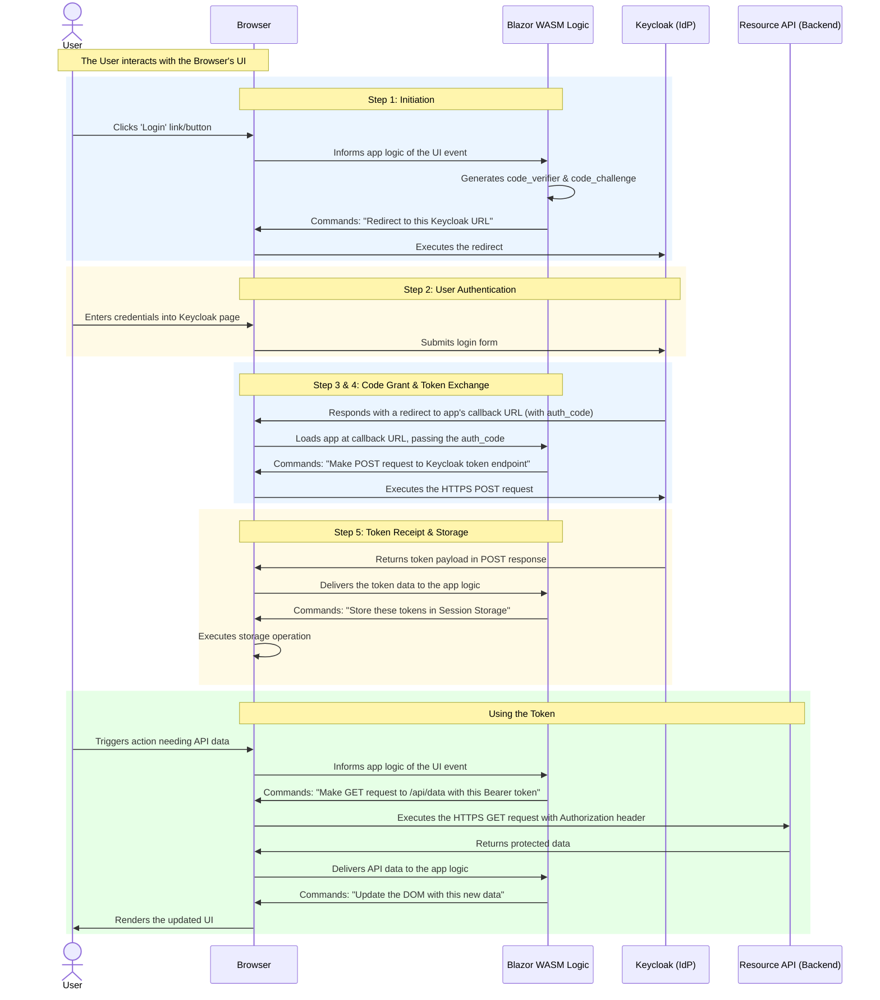
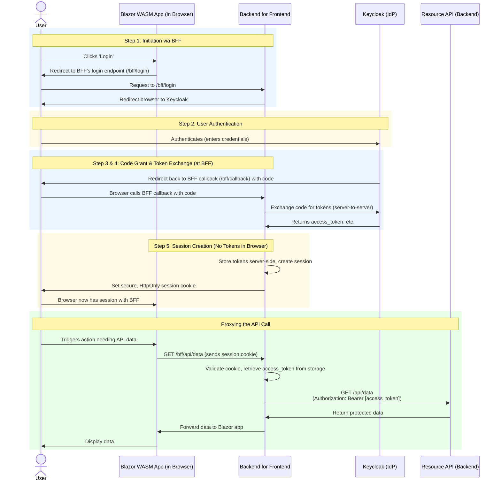

## Carried over from initial sandbox
<details><summary>**Keycloak**</summary>
- Use realm already defined for API, in this case it is 'quotes'
  - Add a scope for Blazor
    - backend-admin-client > client scopes > ...-dedicated > Add Mapper > Configure > MapperType: Audience > quotes_api audience | included client audience= backend-admin-client
    
- Add new client for Blazor
  - 1. OpenId Connect & provide meaningful name (quotes-blazor-client)
  - 2. Client auth: off, Standard flow = checked, all others empty
  - 3. 
    - redirect: https://localhost(blazor)/authentication/login-callback
    - logout: https://localhost(blazor)/authentication/logout-callback
    - TODO: Web Origins? (will auto populate after hitting save)

- From Clients > 

- $ dotnet new blazorwasm -au Individual -o BlazorWasm
- dotnet add package Microsoft.Extensions.Http
- Add to pages/weather.razor:
```csharp
@using Microsoft.AspNetCore.Authorization
@attribute [Authorize]
```

- Add to Blazor program.cs:
```csharp
// Define API & Handle Requests
builder.Services.AddHttpClient("QuotesAPI", client => client.BaseAddress = new Uri("https://localhost:7114"))
    .AddHttpMessageHandler(sp =>
    {
        var handler = sp.GetRequiredService<AuthorizationMessageHandler>()
            .ConfigureHandler(authorizedUrls: ["https://localhost:7114]"]);
        return handler;
    });
// configure auth
builder.Services.AddOidcAuthentication(options =>
{
    options.ProviderOptions.Authority = "http://localhost:8080/realms/quotes";
    options.ProviderOptions.ClientId = "quotes-blazor-client";
    options.ProviderOptions.ResponseType = "code";
    options.ProviderOptions.DefaultScopes.Add("blazor_api_scope"); // TODO
});
```

Of course. Your request to format the content for clarity and scannability is an excellent one. It makes the information much more accessible for different skill levels.

Here is the fully revised and reformatted document, incorporating the "ChatGPT" feedback and your structural requirements.

***
:point_right: [gist AuthN/AuthZ](https://github.com/idusortus/gists/blob/main/AuthN-AuthZ.md)
## Understanding Blazor WASM, OAuth2+PKCE, and Keycloak

This document explains how a Blazor WebAssembly (WASM) application securely authenticates users and accesses a protected back-end API using Keycloak as the Identity Provider (IdP). The process follows the modern standard, **OAuth 2.0 with the PKCE extension**.

---

### Part 1: The Authentication Flow

The authentication process is a five-step dance between the user's browser, your Blazor application, and the Keycloak server.

#### **1. Initiation: Redirecting the User to Log In**
*   **In short:** The app prepares for a secure login and sends the user to Keycloak's official login page.
*   **The Details:** When a user clicks "Login," the Blazor app does not directly make a network request to Keycloak. Instead, it generates two critical pieces for the Proof Key for Code Exchange (PKCE) flow: a secret `code_verifier` and a public `code_challenge` (a hash of the verifier). It then constructs an authorization URL and performs a full browser redirect to Keycloak, passing parameters like `client_id`, `redirect_uri`, `response_type=code`, `scope` (e.g., `"openid profile email offline_access"`), and the `code_challenge`.

#### **2. User Authentication: Proving Identity at Keycloak**
*   **In short:** The user securely enters their credentials directly into Keycloak.
*   **The Details:** The user is now on the official Keycloak domain, entirely outside of your application. They interact with Keycloak's UI to enter their username, password, and any multi-factor authentication (MFA) codes. Your Blazor app has no visibility into this process, ensuring user credentials are never exposed to it.

#### **3. Authorization Grant: Receiving a Temporary "Ticket"**
*   **In short:** After a successful login, Keycloak sends the user back to the app with a temporary, single-use code.
*   **The Details:** Keycloak does not return tokens directly. Instead, it redirects the user's browser back to the `redirect_uri` specified in step 1 (e.g., `https://myapp.com/authentication/login-callback`). Appended to this URL is a temporary, **single-use authorization code**. This code is like a claim ticket; it proves the user just logged in but is not the final credential.

#### **4. Token Exchange: Trading the Ticket for Real Tokens**
*   **In short:** The Blazor app uses the temporary code to request the actual access tokens from Keycloak.
*   **The Details:** The Blazor app's authentication library, now running on the callback page, extracts the authorization code from the URL. It then makes a **direct HTTPS POST request from the browser** to Keycloak’s token endpoint. This request includes the authorization code and the original secret `code_verifier`. This PKCE step proves that the application starting the flow is the same one finishing it, preventing interception attacks.

#### **5. Token Receipt & Storage: Securing the Keys to the API**
*   **In short:** The app receives the tokens from Keycloak and stores them in the browser's Session Storage.
*   **The Details:** After validating the `code_verifier`, Keycloak returns a JSON payload containing the `access_token` (for calling the API) and `id_token` (with user identity info). A `refresh_token` may also be included if the `offline_access` scope was requested and allowed in Keycloak's configuration. The authentication library then stores these tokens in **Session Storage** by default (though this is configurable), making them available for authenticated API requests.

---

### Part 2: Token Storage, Visibility, and Security

Understanding where tokens are stored and who can see them is key to securing your application.

#### **Token Storage: Where do the tokens live?**
*   **In short:** By default, they are stored in the browser's **Session Storage**.
*   **The Details:** Session Storage is tied to a single browser tab's lifecycle. When the user closes the tab, the tokens are automatically deleted. This is more secure than Local Storage, which would persist the tokens on the user's machine indefinitely until manually cleared.

#### **Token Visibility: Can a user see the tokens?**
*   **In short:** Yes, anyone with access to the browser can easily find and inspect them.
*   **The Details:** The tokens are not encrypted at rest in the browser. A user can open Developer Tools (`F12`) and navigate to the **Application tab → Session Storage section** (in Chrome/Edge) or **Storage tab → Session Storage** (in Firefox) to view the raw tokens.

#### **Security Model: If they're visible, why is this safe?**
*   **In short:** Security comes from a layered defense strategy, not from hiding the tokens.
*   **The Details:** The standard SPA security model accepts that tokens are visible in the browser and protects them in other ways:

    *   **Short-Lived Access Tokens:** Access tokens are intentionally set to expire quickly (e.g., 5-15 minutes). This drastically limits the damage if a token is stolen.
    *   **Silent Token Renewal:** To avoid interrupting the user, the app silently renews tokens before they expire. This is done either by using a long-lived `refresh_token` (if available) or by using an invisible iframe with a `prompt=none` authorization request to Keycloak.
    *   **XSS Prevention (The Critical Weakness):** The biggest threat to this model is Cross-Site Scripting (XSS). If an attacker succeeds in injecting malicious JavaScript into your app, they can steal the tokens from storage. Strong XSS prevention is the most important defense you must implement.
    *   **Backend for Frontend (BFF) Pattern (The Ultimate Defense):** For maximum security, some architectures use a server-side component (the BFF). The BFF handles the OAuth flow and stores tokens in **secure, HttpOnly cookies**, which are inaccessible to JavaScript. The Blazor WASM app makes calls to the BFF, which attaches the real tokens to outgoing API requests. This pattern virtually eliminates XSS-based token theft but adds architectural complexity.

---

### **Summary (TL;DR)**  


Blazor WASM apps using OAuth2 with PKCE rely on a **redirect-based flow** to authenticate users. Tokens are stored in the browser's **Session Storage**, where they are visible but protected by other layers of security. The most critical defense is **preventing XSS attacks**. For highly sensitive applications, the **BFF pattern** with HttpOnly cookies provides an even stronger security posture.


---

### 1. Mermaid Diagram: Standard Blazor WASM + PKCE Flow

This diagram illustrates the authentication flow where the Blazor WASM application is a public client handling the OAuth2+PKCE process directly in the browser.

# Oauth2 + PKCE (Verbose)



---

### 2. How the Process Changes with a BFF Pattern

Implementing a **Backend for Frontend (BFF)** pattern fundamentally changes the security model and architecture. The BFF is a server-side application that exists solely to support your Blazor WASM front-end. It acts as a middleman, creating a secure boundary between the browser and your APIs/IdP.

With a BFF, the Blazor WASM app is no longer a public OAuth client. **The BFF becomes the confidential OAuth client.**

Here’s how each part of the process changes:

#### **Change 1: The Authentication Flow is Handled by the Server**
*   **In short:** The BFF handles the entire OAuth dance with Keycloak, not the Blazor app.
*   **The Details:** Instead of redirecting to Keycloak, the Blazor app's "Login" button now points to an endpoint on your BFF (e.g., `/login`). The BFF receives this request and *it* initiates the OAuth redirect to Keycloak. After the user authenticates, Keycloak redirects back to the BFF's callback endpoint. The BFF then performs the token exchange directly with Keycloak over a secure, server-to-server back-channel.

#### **Change 2: Tokens are Never Sent to the Browser**
*   **In short:** The BFF stores the tokens on the server and gives the browser a secure session cookie instead.
*   **The Details:** This is the most significant security improvement. After the BFF gets the access and refresh tokens from Keycloak, it **does not** send them to the Blazor app. Instead, it creates a server-side session for the user, stores the tokens securely within that session (e.g., in memory, a database, or Redis), and sends a **secure, `HttpOnly` cookie** back to the browser to identify the session. Because the cookie is `HttpOnly`, it cannot be accessed by JavaScript, making it immune to theft via XSS attacks.

#### **Change 3: API Calls are Proxied Through the BFF**
*   **In short:** The Blazor app calls the BFF, and the BFF calls the real API.
*   **The Details:** The Blazor app no longer knows anything about access tokens. When it needs to fetch protected data, it makes a simple API call to a proxy endpoint on the BFF (e.g., `/bff/api/data`). The browser automatically attaches the `HttpOnly` session cookie to this request. The BFF receives the call, validates the session cookie, retrieves the corresponding access token from its secure server-side storage, attaches it as a `Bearer` token, and calls the *actual* Resource API. It then forwards the response back to the Blazor app.

#### **Mermaid Diagram: BFF Pattern Flow**

This diagram shows how the BFF acts as a secure intermediary.


</details>